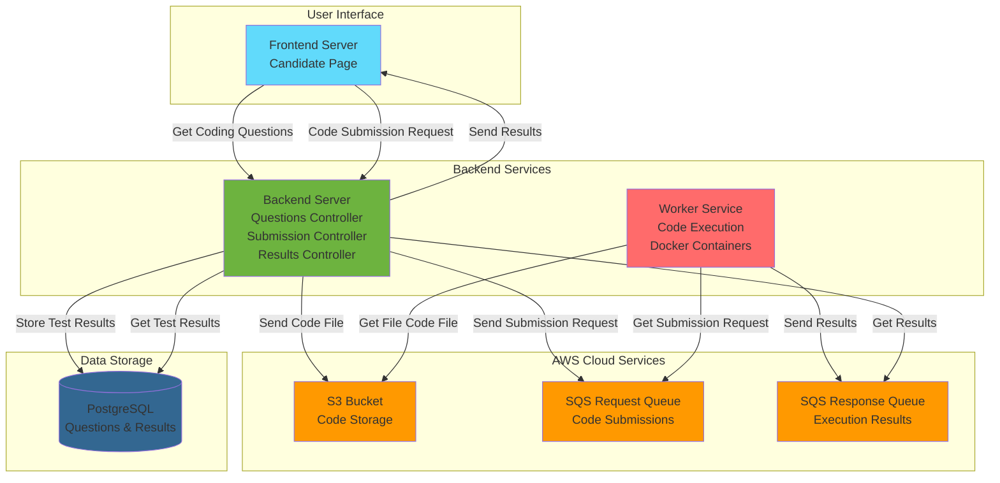
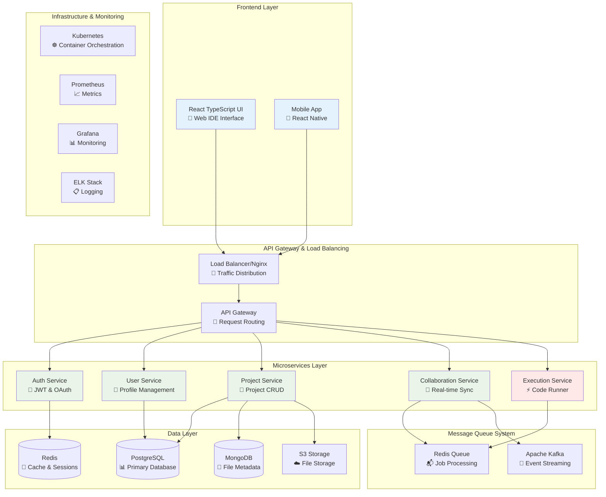

# 🚀 Coding Platform

> A comprehensive full-stack online coding platform that provides an integrated development environment for multiple programming languages with real-time collaboration, secure code execution, and scalable microservices architecture.

[](https://openjdk.org/)
[](https://www.typescriptlang.org/)
[](https://spring.io/projects/spring-boot)
[](https://reactjs.org/)
[](https://www.docker.com/)

## ⚠️ Architecture Notice

**Current Implementation:** This platform currently implements an AWS-based architecture with SQS queues and S3 storage, designed for coding assessment workflows.

**Future Vision:** The enhanced architecture described in this README represents the planned evolution toward a full-featured IDE platform with real-time collaboration capabilities.

## 🏗️ System Architecture

### Current Implementation (AWS-Based)

Based on the existing codebase, this platform uses an AWS-based architecture with the following components:



### 🔄 Current Workflow

1. **User Interaction**: Candidate accesses the frontend page to get coding questions
2. **Question Retrieval**: Backend serves coding questions from PostgreSQL database
3. **Code Submission**: User submits code through the frontend
4. **File Storage**: Backend stores code files in S3 bucket
5. **Queue Processing**: Submission request is sent to SQS request queue
6. **Code Execution**: Worker service picks up requests from SQS queue
7. **File Retrieval**: Worker gets code file from S3 for execution
8. **Result Processing**: Worker executes code in Docker containers and sends results to SQS response queue
9. **Result Storage**: Backend retrieves results from SQS response queue and stores in database
10. **Result Display**: Frontend displays execution results to the user

### 🚀 Future Scope: Enhanced Architecture

_The following represents the planned evolution of the system architecture for better scalability and user experience:_



### 🎯 Planned Enhancements

#### Phase 1: Real-time Collaboration

- WebSocket integration for live code sharing
- Real-time cursor tracking and user presence
- Collaborative editing with conflict resolution
- Live chat and commenting system

#### Phase 2: Enhanced Development Environment

- Multiple file support and project structure
- Integrated terminal and package management
- Git integration with version control
- Code completion and IntelliSense

#### Phase 3: Advanced Features

- AI-powered code suggestions and debugging
- Code review and peer programming tools
- Performance analytics and optimization tips
- Integration with popular development tools

#### Phase 4: Enterprise & Scalability

- Multi-tenant architecture
- Advanced security and compliance features
- Auto-scaling based on demand
- Global CDN and edge computing## 📁 Project Structure

```
coding-platform/
├── 🎨 frontend/                    # React TypeScript Web Application
│   ├── src/
│   │   ├── components/             # Reusable UI components
│   │   ├── pages/                  # Page components
│   │   ├── services/               # API service layer
│   │   ├── hooks/                  # Custom React hooks
│   │   └── utils/                  # Utility functions
│   ├── public/                     # Static assets
│   ├── package.json               # Node.js dependencies
│   └── Dockerfile                 # Production container
│
├── ⚙️ backend/                     # Spring Boot REST API
│   ├── src/main/java/             # Java source code
│   │   ├── controller/            # REST controllers
│   │   ├── service/               # Business logic layer
│   │   ├── repository/            # Data access layer
│   │   ├── model/                 # Entity models
│   │   ├── dto/                   # Data transfer objects
│   │   ├── security/              # Authentication & authorization
│   │   └── config/                # Spring configuration
│   ├── src/main/resources/        # Configuration files
│   ├── pom.xml                    # Maven dependencies
│   └── Dockerfile                 # Production container
│
├── 🔧 worker/                      # Code Execution Service
│   ├── src/main/java/             # Java source code
│   │   ├── service/               # Execution business logic
│   │   ├── executor/              # Language-specific executors
│   │   ├── security/              # Sandbox & security
│   │   └── model/                 # Execution models
│   ├── docker/                    # Language runtime containers
│   ├── pom.xml                    # Maven dependencies
│   └── Dockerfile                 # Production container
│
├── 🏗️ infrastructure/             # Infrastructure as Code
│   ├── terraform/                 # Cloud infrastructure
│   │   ├── modules/               # Reusable Terraform modules
│   │   ├── environments/          # Environment-specific configs
│   │   └── main.tf                # Main infrastructure definition
│   └── ansible/                   # Configuration management
│       ├── playbooks/             # Deployment playbooks
│       ├── roles/                 # Ansible roles
│       └── inventory/             # Environment inventories
│
├── 🐳 docker-compose.yml          # Local development environment
├── 📝 README.md                   # This file
└── 🔒 .gitignore                  # Git ignore rules
```

## 🎯 Services Overview

### 🎨 Frontend Service (Port: 3000)

**Technology Stack:** React 18 + TypeScript + Vite

**Purpose:** Modern web-based IDE interface providing a seamless coding experience

**Key Features:**

- 🖥️ **Monaco Editor Integration** - VS Code-like editing experience
- 🤝 **Real-time Collaboration** - Live cursor tracking and code sharing
- 📁 **Project Management** - File explorer and project organization
- 🎨 **Responsive Design** - Works on desktop, tablet, and mobile
- 🔐 **Authentication UI** - Login, registration, and user management
- 📊 **Dashboard** - Project overview and analytics

**API Integration:**

- Communicates with Backend API for user/project management
- Sends code execution requests to Worker Service
- WebSocket connection for real-time features

---

### ⚙️ Backend Service (Port: 8080)

**Technology Stack:** Java 17 + Spring Boot 3.2 + PostgreSQL + Redis

**Purpose:** Core API server handling business logic, authentication, and orchestration

**Key Features:**

- 🔐 **JWT Authentication** - Secure user authentication and session management
- 👥 **User Management** - Registration, profiles, and role-based access control
- 📁 **Project Management** - CRUD operations for coding projects
- 📄 **File Management** - Code file storage and versioning
- 🔄 **Real-time Communication** - WebSocket support for collaboration
- 📊 **Analytics & Monitoring** - User activity and system metrics
- 🛡️ **Security** - Input validation, SQL injection prevention, XSS protection

**Database Schema:**

- **Users** - User accounts and authentication
- **Projects** - Coding projects and metadata
- **Files** - Code files and content
- **Sessions** - Active user sessions
- **Audit Logs** - System activity tracking

---

### 🔧 Worker Service (Port: 8081)

**Technology Stack:** Java 17 + Spring Boot + Docker + Redis Queue

**Purpose:** Secure, isolated code execution environment supporting multiple programming languages

**Key Features:**

- 🏃 **Multi-language Support** - Java, Python, JavaScript, C++, Go
- 🔒 **Sandboxed Execution** - Docker containers with resource limits
- ⚡ **High Performance** - Optimized for fast code compilation and execution
- 🔄 **Queue Management** - Redis-based job queue for scalability
- 📊 **Resource Monitoring** - CPU, memory, and execution time tracking
- 🛡️ **Security Controls** - Network isolation, file system restrictions
- 📈 **Auto-scaling** - Horizontal scaling based on workload

**Supported Languages:**

- ☕ **Java** - OpenJDK 17 with Maven support
- 🐍 **Python** - Python 3.11 with pip packages
- 🟨 **JavaScript** - Node.js 18 with npm packages
- ⚡ **C++** - GCC compiler with C++17 standard
- 🔵 **Go** - Go 1.21 with module support

**Security Features:**

- Docker container isolation
- Resource limits (CPU, memory, disk)
- Network access restrictions
- Time-based execution limits
- Code validation and sanitization

---

### 🏗️ Infrastructure

**Technology Stack:** Terraform + Ansible + AWS/GCP/Azure

**Purpose:** Automated infrastructure provisioning and configuration management

**Components:**

- **Terraform** - Cloud infrastructure provisioning
- **Ansible** - Server configuration and application deployment
- **Docker** - Containerization and orchestration
- **Nginx** - Load balancing and reverse proxy
- **Monitoring** - Prometheus, Grafana, and logging stack

## 🚀 Quick Start Guide

### Prerequisites

Before you begin, ensure you have the following installed:

- **Node.js** (v18 or higher) - [Download](https://nodejs.org/)
- **Java** (v17 or higher) - [Download](https://adoptium.net/)
- **Maven** (v3.8 or higher) - [Download](https://maven.apache.org/)
- **Docker** & **Docker Compose** - [Download](https://docs.docker.com/get-docker/)
- **Git** - [Download](https://git-scm.com/)

### 🔒 Security Configuration Required

**IMPORTANT:** Before running the application, you must configure sensitive information:

1. **Review the [Security Configuration Guide](infrastructure/SECURITY_CONFIG.md)**
2. **Update placeholder values** in `infrastructure/ansible/secrets.auto.yml`
3. **Configure environment variables** for database connections
4. **Set up AWS credentials** if using cloud deployment

### 🎯 One-Command Setup

```bash
# Clone the repository
git clone https://github.com/tkoppine/coding-platform.git
cd coding-platform

# Start the entire platform
docker-compose up -d

# Wait for services to start (30-60 seconds)
# Then access the platform at http://localhost:3000
```

### 🌐 Access Points

After running `docker-compose up -d`:

| Service               | URL                   | Description         |
| --------------------- | --------------------- | ------------------- |
| 🎨 **Frontend**       | http://localhost:3000 | Main web interface  |
| ⚙️ **Backend API**    | http://localhost:8080 | REST API endpoints  |
| 🔧 **Worker Service** | http://localhost:8081 | Code execution API  |
| 📊 **Database**       | localhost:5432        | PostgreSQL database |
| 🔴 **Redis**          | localhost:6379        | Cache and queue     |

### 🛠️ Development Setup

For development with hot reloading and debugging:

#### 1. Database Setup

```bash
# Start only the database services
docker-compose up -d postgres redis
```

#### 2. Backend Development

```bash
cd backend
mvn clean install
mvn spring-boot:run

# API will be available at http://localhost:8080
# Swagger UI at http://localhost:8080/swagger-ui.html
```

#### 3. Worker Development

```bash
cd worker
mvn clean install
mvn spring-boot:run

# Worker service available at http://localhost:8081
```

#### 4. Frontend Development

```bash
cd frontend
npm install
npm start

# Development server at http://localhost:3000
# Hot reloading enabled
```

## 🔧 API Documentation

### Backend API Endpoints

#### Authentication

```http
POST /api/auth/login          # User login
POST /api/auth/register       # User registration
POST /api/auth/refresh        # Refresh JWT token
DELETE /api/auth/logout       # User logout
```

#### User Management

```http
GET    /api/users/profile     # Get current user profile
PUT    /api/users/profile     # Update user profile
GET    /api/users/{id}        # Get user by ID (admin)
```

#### Project Management

```http
GET    /api/projects          # List user projects
POST   /api/projects          # Create new project
GET    /api/projects/{id}     # Get project details
PUT    /api/projects/{id}     # Update project
DELETE /api/projects/{id}     # Delete project
```

#### File Management

```http
GET    /api/projects/{id}/files    # List project files
POST   /api/projects/{id}/files    # Create new file
GET    /api/files/{id}             # Get file content
PUT    /api/files/{id}             # Update file content
DELETE /api/files/{id}             # Delete file
```

### Worker API Endpoints

#### Code Execution

```http
POST /api/execute             # Execute code
GET  /api/execute/{id}        # Get execution result
GET  /api/languages           # List supported languages
```

#### Example: Code Execution Request

```json
POST /api/execute
Content-Type: application/json

{
  "code": "public class Main { public static void main(String[] args) { System.out.println(\"Hello, World!\"); } }",
  "language": "java",
  "input": "",
  "timeout": 30
}
```

#### Example: Execution Response

```json
{
  "executionId": "uuid-here",
  "status": "SUCCESS",
  "output": "Hello, World!\n",
  "error": null,
  "executionTime": 1247,
  "memoryUsed": 15360,
  "language": "java"
}
```

## 🧪 Testing

### Backend Tests

```bash
cd backend
mvn test                    # Unit tests
mvn verify                  # Integration tests
mvn jacoco:report          # Coverage report
```

### Frontend Tests

```bash
cd frontend
npm test                   # Unit tests
npm run test:coverage     # Coverage report
npm run test:e2e          # End-to-end tests
```

### Worker Tests

```bash
cd worker
mvn test                   # Unit tests
mvn verify                 # Integration tests
```

## 🚀 Production Deployment

### Using Docker (Recommended)

1. **Build Production Images**

```bash
# Build all services
docker-compose -f docker-compose.prod.yml build

# Or build individually
docker build -t coding-platform-frontend ./frontend
docker build -t coding-platform-backend ./backend
docker build -t coding-platform-worker ./worker
```

2. **Deploy with Docker Compose**

```bash
docker-compose -f docker-compose.prod.yml up -d
```

### Using Infrastructure as Code

1. **Provision Infrastructure**

```bash
cd infrastructure/terraform
terraform init
terraform plan -var-file="environments/production/terraform.tfvars"
terraform apply
```

2. **Configure and Deploy**

```bash
cd infrastructure/ansible
ansible-playbook -i inventory/production/hosts playbooks/site.yml
```

## 📊 Monitoring & Observability

### Health Checks

- **Backend**: http://localhost:8080/actuator/health
- **Worker**: http://localhost:8081/actuator/health
- **Frontend**: http://localhost:3000/health

### Metrics & Monitoring

- **Prometheus**: http://localhost:9090
- **Grafana**: http://localhost:3001 (admin/admin)
- **Application Logs**: Available via Docker logs

### Performance Monitoring

```bash
# View service metrics
curl http://localhost:8080/actuator/metrics
curl http://localhost:8081/actuator/metrics

# Check resource usage
docker stats
```

## 🔒 Security Features

### ⚠️ Important Security Notice

**This repository contains placeholder values for sensitive configuration.** Before deploying to any environment, please review and update all security-related configurations.

**📋 Security Checklist:**

- [ ] Replace all placeholder values in `infrastructure/ansible/secrets.auto.yml`
- [ ] Configure Ansible Vault for `infrastructure/ansible/secrets.yml`
- [ ] Update Terraform configuration with your actual resource names
- [ ] Set up proper IAM roles and policies
- [ ] Configure environment variables for all services
- [ ] Review the [Security Configuration Guide](infrastructure/SECURITY_CONFIG.md)

### Authentication & Authorization

- JWT-based authentication
- Role-based access control (RBAC)
- Session management with Redis
- Password encryption with BCrypt

### Code Execution Security

- Docker container isolation
- Resource limits (CPU, memory, disk)
- Network isolation
- Code validation and sanitization
- Execution timeout controls

### API Security

- Input validation and sanitization
- SQL injection prevention
- XSS protection
- CORS configuration
- Rate limiting

## 🤝 Contributing

We welcome contributions! Please see our [Contributing Guidelines](CONTRIBUTING.md) for details.

### Development Workflow

1. **Fork the repository**
2. **Create a feature branch**: `git checkout -b feature/amazing-feature`
3. **Make your changes** and add tests
4. **Commit your changes**: `git commit -m 'Add amazing feature'`
5. **Push to branch**: `git push origin feature/amazing-feature`
6. **Open a Pull Request**

### Code Standards

- Follow existing code style and conventions
- Write comprehensive tests for new features
- Update documentation for any API changes
- Ensure all tests pass before submitting PR

## 📋 Roadmap

### Phase 1: Core Features ✅

- [x] Basic project management
- [x] Multi-language code execution
- [x] User authentication
- [x] Docker containerization

### Phase 2: Enhanced Features 🚧

- [ ] Real-time collaboration
- [ ] Advanced project templates
- [ ] Plugin system
- [ ] Mobile responsive design

### Phase 3: Advanced Features 📋

- [ ] AI-powered code suggestions
- [ ] Git integration
- [ ] Team collaboration features
- [ ] Performance analytics

### Phase 4: Enterprise Features 📋

- [ ] Single Sign-On (SSO)
- [ ] Advanced security features
- [ ] Audit logging
- [ ] Enterprise deployment options

## 📞 Support & Contact

**Developer:** Teja Naidu Koppineni

- 🐙 **GitHub**: [@tkoppine](https://github.com/tkoppine)
- 💼 **LinkedIn**: [Teja Naidu Koppineni](https://www.linkedin.com/in/tejanaidukoppineni/)
- 📧 **Email**: Available on GitHub profile

### Getting Help

- 🐛 **Bug Reports**: [Create an Issue](https://github.com/tkoppine/coding-platform/issues)
- 💬 **Questions**: [GitHub Discussions](https://github.com/tkoppine/coding-platform/discussions)
- 📖 **Documentation**: Check the individual service README files

## 📝 License

This project is licensed under the MIT License - see the [LICENSE](LICENSE) file for details.

## 🙏 Acknowledgments

- **Spring Boot Team** - For the excellent Java framework
- **React Team** - For the powerful frontend library
- **Docker Team** - For containerization technology
- **Open Source Community** - For the amazing tools and libraries

---

<div align="center">

**⭐ Star this repository if you find it helpful!**

Built with ❤️ by [Teja Naidu Koppineni](https://github.com/tkoppine)

</div>
